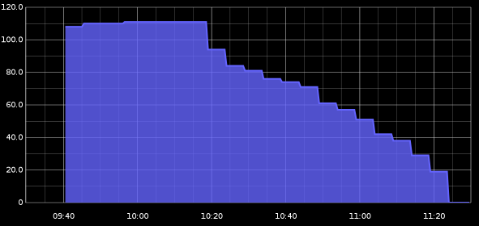

gmail-graphite
==============

Overview
--------
This module runs as a LaunchDaemon and periodically polls a GMail account's status feed, parses the unread message count and sends it to a Graphite instance for graphing and analysis.

Installation
------------

To install on Mac OS El Capitan or later, you'll need to ensure you're running a user-modifiable python framework or you'll run into issues with pip install being blocked by System Integrity Protection.

Install python via homebrew:

    $ brew install python
    $ pip --version

(You may run into issues running as a LaunchDaemon, because the daemon will not necessarily use your user-modifiable python. This can be circumvented by replacing the `#!/usr/bin/env python` shebang with one that points to your
user-modifiable installation.)

Copy config and add credentials including your hosted graphite API key:

    $ cp config_example.py config.py

To start the launchctl service:
    $ ./start.sh

Test w/ this command:

    $ launchctl list | grep graphite

It should output something like:

    $ launchctl list | grep graphite
    -				0	com.justinknoll.graphite.fullcount

Copy the script to ~/bin:

    $ cp inbox_feed_graphite.py ~/bin/

To make the launchd scripts run as a daemon on boot, you will need to set the .plist files chown root and chmod wheel, then copy them to /Library/LaunchDaemons/.

Notes
-----

This mechanism is incompatible with two-factor authentication.

Make sure the com.justinknoll.graphite.fullcount.plist file is owned by you and chmod 600.

It appears that you cannot refer to ~ within the paths in the .plist.

If forced to modify the .plist, you can validate your edits with:

    $ plutil com.justinknoll.graphite.fullcount.plist

If running the ~/bin/ file works, but launchd seems to be failing, try:

    $ tail -f /var/log/system.log # Or use Console.app and search for launchd.

When running as a LaunchDaemon on a system with software updates set to automatic, it's helpful to enable automatic user login if the machine is in a physically secure location. Without this, a software update will reboot the system and the machine will not re-join the wifi network.
